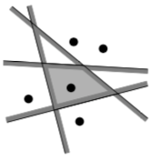
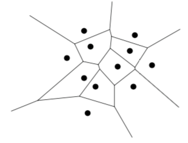
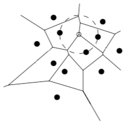
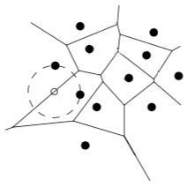
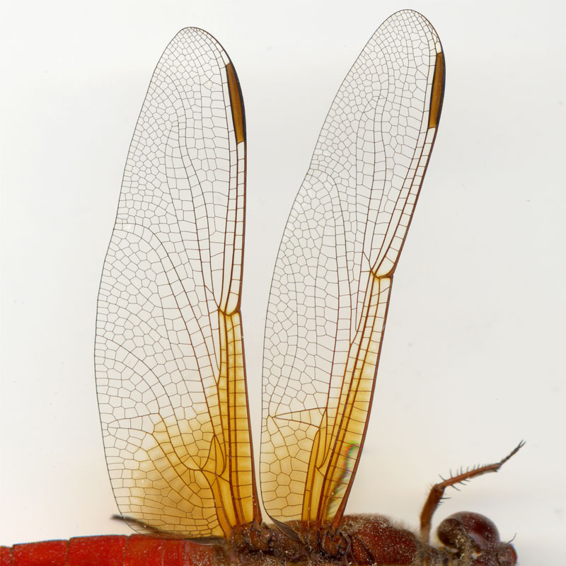

The beauty of Voronoi
=====================

## Motivation

Voronoi diagrams are found in nature on the skin of giraffes, veins of leaves und dragonfly wings.
In biology, Voronois are used to model biological structures, in ecology, they are used to study growth patterns of forrests and in case of incoming emergency calls, Voronoi diagrams can alert the nearest fire station, also known as nearest neighbour queries.
There are many applications in natural sciences, health, engineering, geometry and computer science.

This article wants to illuminate two properties forming a Voronoi cell, namely how an edge and a vertex of a Voronoi are described.

## Introduction

First, we need a terminology to speak about Voronoi diagrams.
Image a plane and a point set $P$ with distinct points which are called sites.
A Voronoi maps each point on the plane $p_{x,y}$ to its nearest site by subdividing the plane into $n$ cells, denoted by $\mathcal{V}(p_i)$.
Since we talk about a structure in $\mathbb{R}^2$, we take the Euclidean distance between to points $p$ and $q$.
$$
\begin{align}
    d(p, q) := \sqrt{ (p_x - q_x)^2 + (p_y - q_y)^2 }
\end{align}
$$

In other words $q$ corresponds to the site $p_i$ if and only if $d(q, p_i) < d(q, p_j)$ for each $p_j \in P$ with $i \neq j$.

Next we define the bisector between two sides $p$ and $q$ as the perpendicular bisector of the line segment $\overline{pq}$.
This bisector splits the the plane into two half-planes.
The half-plane containing $p$ is denoted by $h(p,q)$ and the half-plane containing $q$ by $h(q,p)$.
Combining several half-planes surrounding a site $p_i$ we have the observation that 
$$
\begin{align}
    \mathcal{V}(p_i) = \bigcup h(p_i, p_j), i \neq j 
\end{align}
$$

Following picture illustrates this 

When you do this with all sites in the plane you create a Voronoi diagram illustrated here

All these Voronoi cells forms a Voronoi diagram, denoted by $Vor(P)$.

## Voronoi vertices

The question this section tries to answer is, under which conditions a Voronoi diagram has a Voronie vertice where Voronoi edges meet other Voronoi edges. The answer is simnple. 

For the Voronoi diagram $Vor(P)$ of a set of points $P$ it holds, that a point $q$ is a vertrx of $Vor(P)$ if and only if its largest empty circle $C_P(q)$ contains three or more sites on its boundary.

Speaking in pictures one would express it as follows

Look at the picture above.
The white vertex $q$ has three points on its boundary.
Imagine an empty circle at every vertex, you will see that no less than three sites forms a vertex.

Lets proof this. 

Suppose there is a point $q$ such that $C_P(q)$ contains three or more sites on its boundary.
Let $p_i, p_j, p_k$ be three of those sites.
Since the interior of $C_P(q)$ is empty $q$ must be on the boundary of each of $\mathcal{V}(p_i), \mathcal{V}(p_j), \mathcal{V}(p_k)$, and $q$ must be a vertex of $Vor(P)$.
Every vertex $q$ of $Vor(P)$ is incident to at least three edges and, hence, to at least three cells $\mathcal{V}(p_i), \mathcal{V}(p_j), \mathcal{V}(p_k)$.
Every vertex $q$ must be equidistant to $p_i, p_j, p_k$ and there cannot be another site closer to $q$, since otherwise $\mathcal{V}(p_i), \mathcal{V}(p_j), \mathcal{V}(p_k)$ would not meet at $q$.
Hence, the interior of the circle with $p_i, p_j, p_k$ on its boundary does not contain any site.

## Voronoi edges

Now suppose we move the white point $q$ along an edge in $Vor(P)$ and the circle $C_P(q)$ has two sites on its boundary and these sites are equidistant to $q$.
We can do this as long as no other sites appear on the boundary of $C_P(q)$, since this would mean another vertex of $Vor(P)$.
This forms an edge, as simple as that.

Once again, speaking in pictures one would express it as follows

In a more formal way we state that the bisector between sites $p_i$ and $p_j$ defines an edge of $Vor(P)$ if and only if there is a point $q$ on the bisector such that $C_P(q)$ contains both $p_i$ and $p_j$ on its boundary but no other site.

Lets proof this.

Suppose there is a point $q$ with the property.
Since $C_P(q)$ does not contain any sites in its interior and $p_i, p_j$ are on its boundary, we have $d(q, p_i) = d(q, p_j) \leq d(q, p_k)$ for all $1 \leq k \leq n$.
It follows that $q$ lies on an edge or vertex of $Vor(P)$.
$q$ cannot be a vertex of $Vor(P)$, hence $q$ lies on an edge of $Vor(P)$, which is defined by the bisector of $p_i, p_j$.
Conversevly, let the bisector of $p_i, p_j$ define a Voronoi edge.
The largest empty circle of any point $q$ in the interior of this edge must contain $p_i, p_j$ on its boundary and no other sites.

## Summary

Now we can move a circle in mind within an Voronoi diagram in order to recreate the vertices and edges by moving these circle along the bisectors of a point set.
This is beautiful and I amazed to recognize this pattern in nature.

